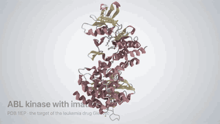
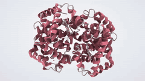
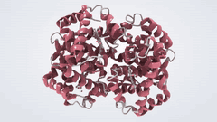
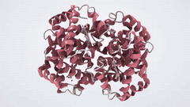
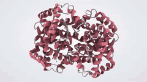
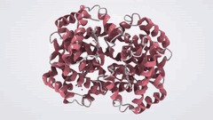
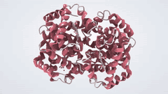
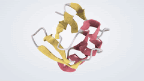
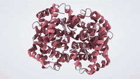

# Video examples

Step-by-step notebooks for making videos of molecules; no programming experience needed. Open
them in Jupyter Notebook or JupyterLab with `pip install ipyspeck` and run the cells from the top.

| Notebook | You will make |
|---|---|
| [01 Your first video](01_first_video.ipynb) | a hemoglobin tour in three steps, and how to change size, length and background |
| [02 Ready-made videos](02_ready_made_videos.ipynb) | every ready-made video: spin, rock, orbit, tour, focus, cut open, showcase |
| [03 A drug in its pocket](03_drug_in_its_pocket.ipynb) | a close-up of imatinib in ABL kinase, choosing what to look at |
| [04 Moving molecules](04_moving_molecules.ipynb) | an NMR ensemble played smoothly, and your own MD trajectory |
| [05 Materials](05_materials.ipynb) | a gold nanocluster: spin and cut through its core |
| [06 Your own film](06_your_own_film.ipynb) | a storyboard of shots, and moves you pose yourself |
| [07 A guided tour](07_guided_tour.ipynb) | a one-minute tour of a drug target's landmarks, from a list of stops |

## A guided tour

ABL kinase with imatinib: the lobes, the hinge, the gatekeeper, the DFG motif, the P-loop and the drug,
each highlighted and captioned ([notebook 07](07_guided_tour.ipynb), [full video](../../../media/videos/kinase_tour.mp4)).

## Ready-made videos

One line each, e.g. `w.save_video("movie.mp4", "tour")`, or the clapperboard button in the viewer.

<table>
<tr>
<td align="center" width="25%"> <code>spin</code> one full turn, loops</td>
<td align="center" width="25%"> <code>rock</code> swing back and forth, loops</td>
<td align="center" width="25%"> <code>orbit</code> a turn around a tilted axis</td>
<td align="center" width="25%"> <code>tour</code> fly to the ligand and back</td>
</tr>
<tr>
<td align="center" width="25%"> <code>focus</code> close-up, focus on the ligand</td>
<td align="center" width="25%"> <code>reveal</code> cut open while turning</td>
<td align="center" width="25%"> <code>trajectory</code> play the frames smoothly</td>
<td align="center" width="25%"> <code>showcase</code> turn, close-up, back</td>
</tr>
</table>
